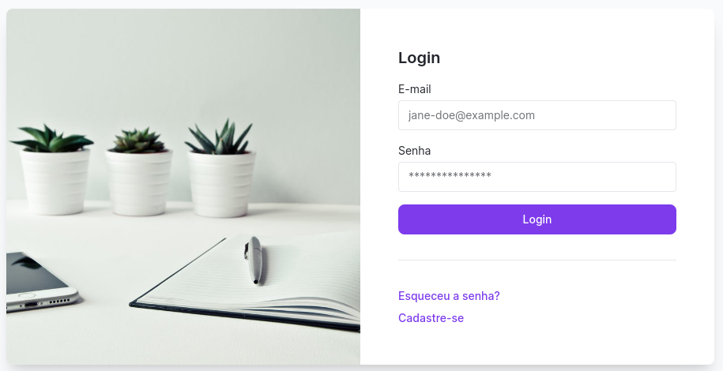
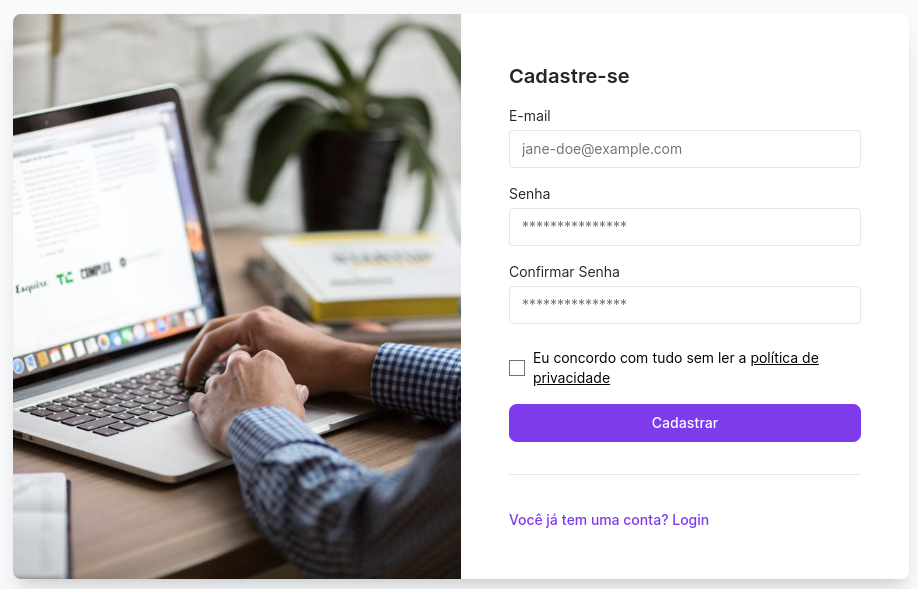
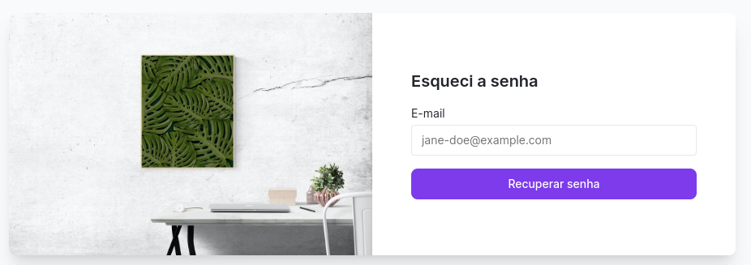
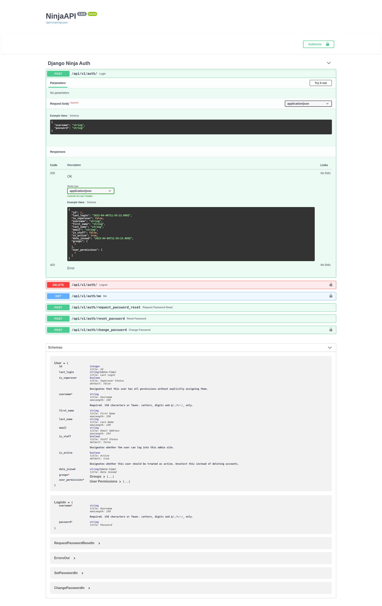

# login-vuejs-django-ninja

Sistema de Login entre VueJS e Django-Ninja

## Frontend

* Template: [Windmill](https://windmillui.com/dashboard-html)
* Github: [windmill-dashboard](https://github.com/estevanmaito/windmill-dashboard)





### Instalação

```
npm install -g @vue/cli
```

#### Use [node](https://nodejs.org/en/) com [nvm](https://github.com/nvm-sh/nvm).

```
nvm use 18.3.0
```


### Criando o projeto

```
npm create vite@latest frontend -- --template vue
cd frontend
yarn

# vue create frontend

yarn add vue-router@4 --save
yarn add axios
vue add pinia vee-validate

yarn dev  # ou
# npm run serve
```

https://vueschool.io/lessons/installing-and-setting-up-vue-router-with-vite-vite-only


```
# dentro da pasta frontend
mkdir src/plugins
touch src/plugins/vee-validate.js
touch src/plugins/axios.js
```

Ref: [alpinejs-tailwindcss-example](https://github.com/rg3915/alpinejs-tailwindcss-example)


### Instalando TailwindCSS

[Leia mais](install_tailwind.md)


## Dados com [json-server](https://www.npmjs.com/package/json-server) (Opcional)

```
npm i -g json-server
```

Crie `db.json`

```
mkdir api
touch api/db.json
```

```json
{
  "todos": [
    {
      "id": 1,
      "task": "One"
    },
    {
      "id": 2,
      "task": "Two"
    },
    {
      "id": 3,
      "task": "Three"
    }
  ]
}
```

Rode o json-server

```
json-server --watch api/db.json
```


## Backend

### Bibliotecas

* [django-ninja](https://django-ninja.rest-framework.com/)
* [django-ninja-auth](https://github.com/mugartec/django-ninja-auth)
* [django-ninja-jwt](https://eadwincode.github.io/django-ninja-jwt/)

### Criando o projeto

```
python -m venv .venv

source ./venv/bin/activate  # ou
# .venv\Scripts\activate  # Windows

pip install django-ninja-auth python-decouple django-extensions isort autopep8

django-admin startproject backend .
cd backend/
```

### Autenticação

[mugartec/django-ninja-auth](https://github.com/mugartec/django-ninja-auth)

TODO: [django-ninja-jwt](https://eadwincode.github.io/django-ninja-jwt/)


### Rotas

Edite `backend/urls.py`

```python
# urls.py
from django.contrib import admin
from django.http import JsonResponse
from django.urls import path

from .api import api


def todo(request):
    data = [
        {
            "id": 1,
            "task": "The quick brown fox"
        },
        {
            "id": 2,
            "task": "over the lazy dog"
        }
    ]
    return JsonResponse(data, safe=False)


def about(request):
    return JsonResponse({'status': 'OK'})


urlpatterns = [
    path('todo/', todo),
    path('about/', about),
    path('admin/', admin.site.urls),
    path('api/v1/', api.urls),
]
```

Crie e edite `backend/api.py`

```python
# api.py
from ninja import NinjaAPI
from ninja_auth.api import router as auth_router

api = NinjaAPI(csrf=True)

api.add_router('/auth/', auth_router)
```

Rode as migrações e crie um super usuário.

```
python manage.py migrate
python manage.py createsuperuser
```

Rode a aplicação.

```
python manage.py runserver
```

Acesse a doc em `/api/v1/docs/`


